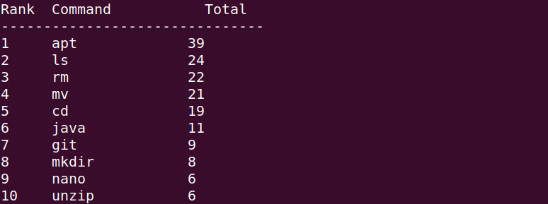

# cmdfreq


A minimal command-line tool written in C that analyzes a shell history file and displays the most frequently used commands

## Features

- Groups subcommands (e.g. `git commit` → `git`)
- Ignores `sudo` prefix
- No external dependencies
- Lightweight and fast

## Build

```bash
make
```

## Usage

```bash
./cmdfreq <history_file>
```

Example:

```bash
./cmdfreq ~/.bash_history
./cmdfreq ~/.zsh_history
```

## Example Output



## Requirements

- GCC
- POSIX-compatible system
